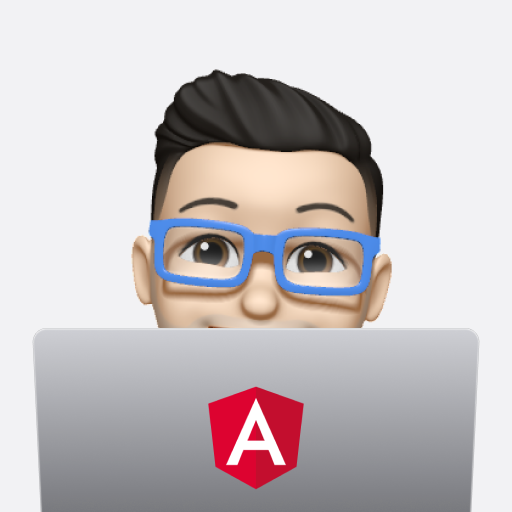

# Hi there 👋

[](https://rafalwolak.pl)
[](https://www.linkedin.com/in/rafalwolak/)

<picture>
  <source media="(prefers-color-scheme: dark)" srcset="assets/macbook-angular-mono-happy.png">
  <source media="(prefers-color-scheme: light)" srcset="assets/macbook-angular-happy.png">
  
</picture>

*I'm a senior front-end developer at [Tom&Co.](https://www.tomandco.co.uk/)*

Then I learned **HTML** and **CSS** to prepare my first website. A few years later, I learned **PHP** to build websites on **WordPress** and e-commerce websites on **PrestaShop** and **OpenCart**. This experience gave me the opportunity to work as a programmer in a small internet agency, where I was responsible for creating websites based on the company's CMS. In order to increase the quality and meet customer requirements, I forced the transition to WordPress as the primary management system for customer websites.

With the changing trends, I started learning single-page application frameworks like **AngularJS** and **React**. This knowledge gave me the opportunity to work in a larger company on much larger e-commerce projects.

I am working on projects with thousands of unique visitors for the largest stores in the UK and worldwide. On the front end, we use a headless CMS based on **Angular** (currently 14) which communicates with **Magento** on the backend.

 - 🌱 I’m currently learning Dart and Flutter;

## Technologies
      
## Environment
[](https://en.wikipedia.org/wiki/MacOS)
[](https://code.visualstudio.com/)

## Stats
<details>
<summary>Weekly development breakdown</summary>

<!--START_SECTION:waka-->

```txt
TypeScript   13 hrs 53 mins  ██████████████████▒░░░░░░   73.23 %
Other        2 hrs 24 mins   ███░░░░░░░░░░░░░░░░░░░░░░   12.65 %
HTML         1 hr 21 mins    █▓░░░░░░░░░░░░░░░░░░░░░░░   07.18 %
JSON         52 mins         █░░░░░░░░░░░░░░░░░░░░░░░░   04.59 %
Text         24 mins         ▓░░░░░░░░░░░░░░░░░░░░░░░░   02.19 %
```

<!--END_SECTION:waka-->
</details>
